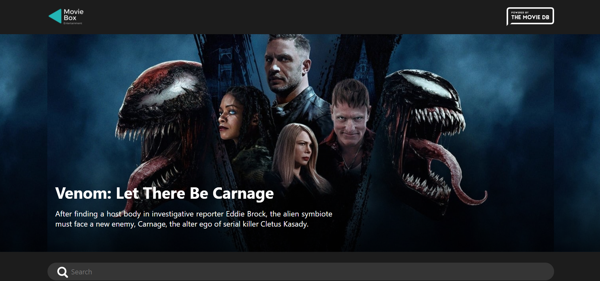
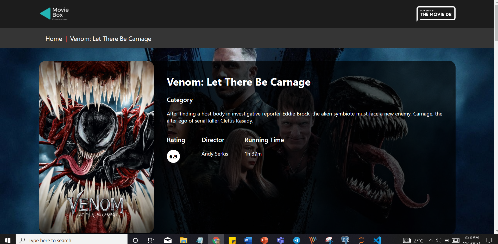

# Movie Box Entertainment

## Home Page

## About Movie Page

This project was bootstrapped with [Create React App](https://github.com/facebook/create-react-app).

## Features
 - Popular Movies based on ratings
 - Quick Search 
 - Movie Desciption Page (Category, Rating, Director(s) & Running time)
 - Movie Actors Thumbnails
 - Session Storage

## Available Scripts

In the project directory, you can run:

### `npm start`

Runs the app in the development mode.\
Open [http://localhost:3000](http://localhost:3000) to view it in the browser.

